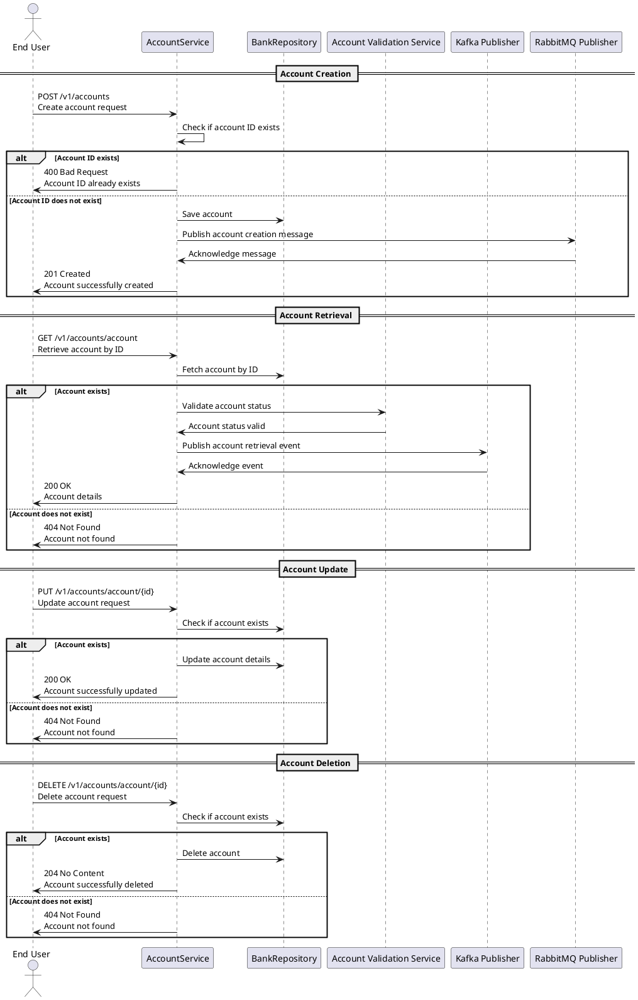

## Business Logic

### 1. Summary of the Service

The service is designed to manage account-related operations, providing functionalities such as retrieving, creating, updating, and deleting account information. It utilizes a structured approach to handle requests via a RESTful API, allowing consumers to interact with account data effectively. The service implements a layered architecture that includes a controller for handling API requests, a service layer for business logic, and a data access layer for database interactions. It also incorporates exception handling for better error management and utilizes messaging systems for asynchronous communication. The application is configured to connect to both relational and non-relational databases, ensuring data persistence and retrieval capabilities.

### 2. Service Breakdown Table

| **Base Path** | **Source Repository** | **Description** |
|----------------|-----------------------|------------------|
| `/v1/accounts` | [GitHub Repo Link](#) | API for managing account operations, including retrieving account details, creating new accounts, updating existing accounts, and deleting accounts. |

### 3. Overall API Specification

| **Endpoint**                | **Method** | **Description**                                             | **Authentication** | **Expected Behavior**                                      |
|-----------------------------|------------|-------------------------------------------------------------|--------------------|-----------------------------------------------------------|
| `/v1/accounts`              | GET        | Retrieve a list of all accounts.                           | None               | Returns a list of account details.                        |
| `/v1/accounts`              | POST       | Create a new account.                                      | None               | Creates a new account and returns the created account.    |
| `/v1/accounts/{id}`         | GET        | Retrieve account details by ID.                            | None               | Returns the account details if found; otherwise, returns 404. |
| `/v1/accounts/{id}`         | PUT        | Update an existing account by ID.                          | None               | Updates the account details if found; otherwise, returns 404. |
| `/v1/accounts/{id}`         | DELETE     | Delete an account by ID.                                   | None               | Deletes the account if found; otherwise, returns 404.     |

### 4. Endpoints Summary

- **Retrieve All Accounts**: 
  - **Endpoint**: `/v1/accounts`
  - **Method**: GET
  - **Description**: Retrieves a list of all accounts.

- **Create New Account**: 
  - **Endpoint**: `/v1/accounts`
  - **Method**: POST
  - **Description**: Creates a new account.

- **Retrieve Account by ID**: 
  - **Endpoint**: `/v1/accounts/{id}`
  - **Method**: GET
  - **Description**: Retrieves account details by a specific ID.

- **Update Account by ID**: 
  - **Endpoint**: `/v1/accounts/{id}`
  - **Method**: PUT
  - **Description**: Updates an existing account's details by ID.

- **Delete Account by ID**: 
  - **Endpoint**: `/v1/accounts/{id}`
  - **Method**: DELETE
  - **Description**: Deletes an account by ID.

This structured summary provides a clear overview of the service's functionality and API specifications, making it easier for developers and stakeholders to understand the system's capabilities.

## Plant UML script

Here is a PlantUML sequence diagram script based on the provided business logic. This script includes all key actors, interactions, decision points, and components involved in the account management service.



### Explanation of the Diagram:
1. **Actors and Participants**: The diagram includes the "End User," "AccountService," "BankRepository," "Account Validation Service," "Kafka Publisher," and "RabbitMQ Publisher."
2. **Main Interactions**: It shows the sequence of operations for account creation, retrieval, updating, and deletion.
3. **Decision Points**: The `alt` blocks represent decision points, such as checking if an account ID exists or if the account exists for update/delete operations.
4. **Messages**: Clear and descriptive messages are used to indicate the actions taken and responses sent.
5. **Components**: All relevant components involved in the service are mentioned, including the messaging systems (Kafka and RabbitMQ).
6. **Endpoints**: All specified endpoints are displayed in the respective interactions.

This sequence diagram script can be rendered using any PlantUML-compatible tool to visualize the interactions and flows in the account management system.

## UML Sequence Diagram


## UML Sequence Diagram Path

account/images/AccountService_db5ce9c9-0d73-4039-b02a-79bc0df20ad5.png

## API Documentation

# API Documentation

## 1. Retrieve All Accounts

### API Specification
- **Endpoint URL:** `/v1/accounts`
- **HTTP Method:** `GET`
- **Authentication & Authorization Requirements:** No
- **Description of the API Functionality:** Retrieves a list of all accounts in the system.

### Request Parameters
| Parameter | Type   | Required | Constraints  |
|-----------|--------|----------|--------------|
| None      | -      | No       | -            |

### Sample Request
```http
GET /v1/accounts HTTP/1.1
Host: api.example.com
```

### Response Parameters
| Field     | Type         | Description                        |
|-----------|--------------|------------------------------------|
| accounts  | Array        | List of account objects            |

### Sample Response
```json
{
  "accounts": [
    {
      "id": 1,
      "name": "John Doe",
      "email": "john.doe@example.com",
      "accountNumber": "123456789",
      "accountType": "savings",
      "dob": "1990-01-01",
      "bankCode": "BANK123"
    },
    {
      "id": 2,
      "name": "Jane Smith",
      "email": "jane.smith@example.com",
      "accountNumber": "987654321",
      "accountType": "checking",
      "dob": "1985-05-15",
      "bankCode": "BANK456"
    }
  ]
}
```

### Components Involved
- **Services:** AccountService
- **Databases:** SQL (PostgreSQL)
- **External APIs:** None

### Data Mapping
| Source Entity    | Target Entity   | Transformation Details                   |
|------------------|-----------------|------------------------------------------|
| AccountEntity    | AccountDTO      | Mapped fields from AccountEntity to AccountDTO for response |

### Sample Errors
```json
{
  "error": {
    "code": "BAD_REQUEST",
    "message": "Invalid request format"
  }
}
```

### Root Exception Details
| Name                      | Description                       | Header/Payload | Type    | Mandatory/Optional | Notes                      |
|---------------------------|-----------------------------------|----------------|---------|---------------------|----------------------------|
| BadRequestException       | Thrown when the request is invalid | Payload        | Object  | Mandatory           | Invalid request format     |

### Error Codes
| HTTP Code | Message            | Description                       |
|-----------|--------------------|-----------------------------------|
| 400       | Bad Request         | The request was invalid           |
| 500       | Internal Server Error| An unexpected error occurred      |

---

## 2. Retrieve Account by ID

### API Specification
- **Endpoint URL:** `/v1/accounts/account`
- **HTTP Method:** `GET`
- **Authentication & Authorization Requirements:** No
- **Description of the API Functionality:** Retrieves account details by account ID.

### Request Parameters
| Parameter | Type   | Required | Constraints  |
|-----------|--------|----------|--------------|
| id        | Long   | Yes      | Must be a valid account ID |

### Sample Request
```http
GET /v1/accounts/account?id=1 HTTP/1.1
Host: api.example.com
```

### Response Parameters
| Field     | Type         | Description                        |
|-----------|--------------|------------------------------------|
| account   | Object       | Account object with details        |

### Sample Response
```json
{
  "account": {
    "id": 1,
    "name": "John Doe",
    "email": "john.doe@example.com",
    "accountNumber": "123456789",
    "accountType": "savings",
    "dob": "1990-01-01",
    "bankCode": "BANK123"
  }
}
```

### Components Involved
- **Services:** AccountService
- **Databases:** SQL (PostgreSQL)
- **External APIs:** account-validation-service (via Feign client)

### Data Mapping
| Source Entity    | Target Entity   | Transformation Details                   |
|------------------|-----------------|------------------------------------------|
| AccountEntity    | AccountDTO      | Mapped fields from AccountEntity to AccountDTO for response |

### Sample Errors
```json
{
  "error": {
    "code": "RESOURCE_NOT_FOUND",
    "message": "Account not found"
  }
}
```

### Root Exception Details
| Name                      | Description                       | Header/Payload | Type    | Mandatory/Optional | Notes                      |
|---------------------------|-----------------------------------|----------------|---------|---------------------|----------------------------|
| ResourceNotFoundException | Thrown when the account does not exist | Payload        | Object  | Mandatory           | Account not found          |

### Error Codes
| HTTP Code | Message            | Description                       |
|-----------|--------------------|-----------------------------------|
| 404       | Not Found           | The requested account does not exist |
| 500       | Internal Server Error| An unexpected error occurred      |

---

## 3. Create a New Account

### API Specification
- **Endpoint URL:** `/v1/accounts/account`
- **HTTP Method:** `POST`
- **Authentication & Authorization Requirements:** No
- **Description of the API Functionality:** Creates a new account.

### Request Parameters
| Parameter | Type         | Required | Constraints                          |
|-----------|--------------|----------|--------------------------------------|
| account   | Object       | Yes      | Must contain valid account details    |

### Sample Request
```http
POST /v1/accounts/account HTTP/1.1
Host: api.example.com
Content-Type: application/json

{
  "name": "John Doe",
  "email": "john.doe@example.com",
  "accountNumber": "123456789",
  "accountType": "savings",
  "dob": "1990-01-01",
  "bankCode": "BANK123"
}
```

### Response Parameters
| Field     | Type         | Description                        |
|-----------|--------------|------------------------------------|
| id        | Long         | ID of the newly created account     |

### Sample Response
```json
{
  "id": 1
}
```

### Components Involved
- **Services:** AccountService
- **Databases:** SQL (PostgreSQL)
- **Messaging Systems:** RabbitMQ

### Data Mapping
| Source Entity    | Target Entity   | Transformation Details                   |
|------------------|-----------------|------------------------------------------|
| AccountDTO       | AccountEntity    | Mapped fields from AccountDTO to AccountEntity for storage |

### Sample Errors
```json
{
  "error": {
    "code": "BAD_REQUEST",
    "message": "Account ID already exists"
  }
}
```

### Root Exception Details
| Name                      | Description                       | Header/Payload | Type    | Mandatory/Optional | Notes                      |
|---------------------------|-----------------------------------|----------------|---------|---------------------|----------------------------|
| BadRequestException       | Thrown when the account ID exists | Payload        | Object  | Mandatory           | Account ID already exists  |

### Error Codes
| HTTP Code | Message            | Description                       |
|-----------|--------------------|-----------------------------------|
| 400       | Bad Request         | The account ID already exists     |
| 500       | Internal Server Error| An unexpected error occurred      |

---

## 4. Update an Existing Account

### API Specification
- **Endpoint URL:** `/v1/accounts/account/{id}`
- **HTTP Method:** `PUT`
- **Authentication & Authorization Requirements:** No
- **Description of the API Functionality:** Updates an existing account by ID.

### Request Parameters
| Parameter | Type         | Required | Constraints                          |
|-----------|--------------|----------|--------------------------------------|
| id        | Long         | Yes      | Must be a valid account ID           |
| account   | Object       | Yes      | Must contain valid account details    |

### Sample Request
```http
PUT /v1/accounts/account/1 HTTP/1.1
Host: api.example.com
Content-Type: application/json

{
  "name": "John Doe Updated",
  "email": "john.doe.updated@example.com",
  "accountNumber": "123456789",
  "accountType": "savings",
  "dob": "1990-01-01",
  "bankCode": "BANK123"
}
```

### Response Parameters
| Field     | Type         | Description                        |
|-----------|--------------|------------------------------------|
| id        | Long         | ID of the updated account           |

### Sample Response
```json
{
  "id": 1
}
```

### Components Involved
- **Services:** AccountService
- **Databases:** SQL (PostgreSQL)

### Data Mapping
| Source Entity    | Target Entity   | Transformation Details                   |
|------------------|-----------------|------------------------------------------|
| AccountDTO       | AccountEntity    | Mapped fields from AccountDTO to AccountEntity for storage |

### Sample Errors
```json
{
  "error": {
    "code": "RESOURCE_NOT_FOUND",
    "message": "Account not found"
  }
}
```

### Root Exception Details
| Name                      | Description                       | Header/Payload | Type    | Mandatory/Optional | Notes                      |
|---------------------------|-----------------------------------|----------------|---------|---------------------|----------------------------|
| ResourceNotFoundException | Thrown when the account does not exist | Payload        | Object  | Mandatory           | Account not found          |

### Error Codes
| HTTP Code | Message            | Description                       |
|-----------|--------------------|-----------------------------------|
| 404       | Not Found           | The requested account does not exist |
| 500       | Internal Server Error| An unexpected error occurred      |

---

## 5. Delete an Existing Account

### API Specification
- **Endpoint URL:** `/v1/accounts/account/{id}`
- **HTTP Method:** `DELETE`
- **Authentication & Authorization Requirements:** No
- **Description of the API Functionality:** Deletes an existing account by ID.

### Request Parameters
| Parameter | Type         | Required | Constraints                          |
|-----------|--------------|----------|--------------------------------------|
| id        | Long         | Yes      | Must be a valid account ID           |

### Sample Request
```http
DELETE /v1/accounts/account/1 HTTP/1.1
Host: api.example.com
```

### Response Parameters
| Field     | Type         | Description                        |
|-----------|--------------|------------------------------------|
| None      | -            | No content returned on successful deletion |

### Sample Response
```http
204 No Content
```

### Components Involved
- **Services:** AccountService
- **Databases:** SQL (PostgreSQL)

### Data Mapping
| Source Entity    | Target Entity   | Transformation Details                   |
|------------------|-----------------|------------------------------------------|
| AccountEntity    | None            | AccountEntity is deleted from the database |

### Sample Errors
```json
{
  "error": {
    "code": "RESOURCE_NOT_FOUND",
    "message": "Account not found"
  }
}
```

### Root Exception Details
| Name                      | Description                       | Header/Payload | Type    | Mandatory/Optional | Notes                      |
|---------------------------|-----------------------------------|----------------|---------|---------------------|----------------------------|
| ResourceNotFoundException | Thrown when the account does not exist | Payload        | Object  | Mandatory           | Account not found          |

### Error Codes
| HTTP Code | Message            | Description                       |
|-----------|--------------------|-----------------------------------|
| 404       | Not Found           | The requested account does not exist |
| 500       | Internal Server Error| An unexpected error occurred      |

