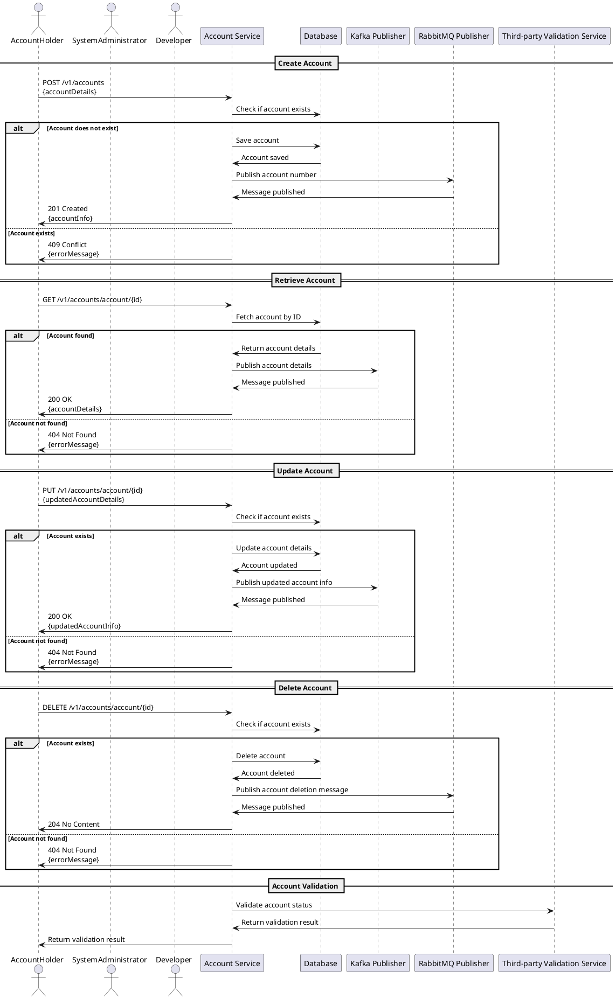

## Business Logic

## 1. Summary of the Service

This service provides a comprehensive API for managing user accounts, allowing operations such as creating, retrieving, updating, and deleting account information. It supports functionalities to interact with both relational and non-relational databases for data persistence. The service is designed to handle account-related requests efficiently, ensuring that account validation and status checks are integrated into the workflow. The API is structured to facilitate easy access to account data while maintaining robust error handling and messaging capabilities.

## 2. Breakdown Table

| **Base Path** | **Source Repository** | **Description** |
|----------------|-----------------------|------------------|
| `/v1/accounts` | [GitHub Repo Link](#) | API for managing user accounts, including operations for creation, retrieval, updating, and deletion of account details. |

## 3. Overall API Specification

| **Endpoint**          | **Method** | **Description**                                         | **Authentication** | **Expected Behavior**                                                                                                   |
|-----------------------|------------|---------------------------------------------------------|--------------------|-------------------------------------------------------------------------------------------------------------------------|
| `/v1/accounts`        | GET        | Retrieve all accounts                                   | None               | Returns a list of all accounts.                                                                                       |
| `/v1/accounts`        | POST       | Create a new account                                    | None               | Creates a new account with the provided details and returns the created account.                                      |
| `/v1/accounts/{id}`   | GET        | Retrieve account by ID                                  | None               | Returns the account details for the specified ID or a 404 error if not found.                                         |
| `/v1/accounts/{id}`   | PUT        | Update an existing account                              | None               | Updates the account details for the specified ID and returns the updated account or a 404 error if not found.          |
| `/v1/accounts/{id}`   | DELETE     | Delete an account by ID                                 | None               | Deletes the account for the specified ID and returns a 204 status code or a 404 error if not found.                    |

### Notes:
- **Authentication**: The API does not specify any authentication requirements in the provided specification. However, it is advisable to implement authentication mechanisms for production environments to secure the API.
- **Error Handling**: The service includes error handling for various scenarios, ensuring that appropriate responses are sent for invalid requests or resource not found situations.

## Plant UML Script

Below is a PlantUML sequence diagram script that captures the key actors, interactions, decision points, and processes involved in the business logic you provided. This diagram covers account creation, retrieval, updating, and deletion, along with the relevant messaging to Kafka and RabbitMQ.



### Explanation of the Diagram:
1. **Actors**: The diagram includes `AccountHolder`, `SystemAdministrator`, and `Developer` as key actors.
2. **Participants**: The main components involved are `Account Service`, `Database`, `Kafka Publisher`, `RabbitMQ Publisher`, and `Third-party Validation Service`.
3. **Interactions**: Each section of the diagram represents a different API endpoint and its interactions.
4. **Decision Points**: The `alt` blocks represent critical decision points where the application checks for the existence of accounts and handles errors.
5. **Messaging**: The diagram clearly shows when messages are published to Kafka and RabbitMQ based on the operations performed.
6. **Endpoints**: All the API endpoints provided in the business logic are represented in the interactions.

This sequence diagram script can be rendered using PlantUML to visualize the described processes and interactions effectively.

## UML Sequence Diagram

(diagram.jpg)
## API Documentation

Sure! Below is the structured API documentation for each endpoint based on the provided business logic.

---

### 1. **Get All Accounts**

#### API Specification
- **Endpoint URL**: `/v1/accounts`
- **HTTP Method**: `GET`
- **Authentication & Authorization Requirements**: None
- **Description of the API Functionality**: Returns a list of all accounts.

#### Request Parameters
| Parameter | Type   | Required/Optional | Constraints        |
|-----------|--------|-------------------|---------------------|
| None      | N/A    | N/A               | N/A                 |

#### Sample Request
```http
GET /v1/accounts HTTP/1.1
Host: api.example.com
```

#### Response Parameters
| Field         | Type       | Description                             |
|---------------|------------|-----------------------------------------|
| accounts      | Array      | List of account objects                 |
| id            | String     | Unique identifier for the account       |
| name          | String     | Name of the account holder              |
| email         | String     | Email associated with the account       |
| accountNumber | String     | Unique account number                   |
| accountType   | String     | Type of account (e.g., savings, checking) |
| dob           | Date       | Date of birth of the account holder     |
| bankCode      | String     | Code of the associated bank             |

#### Sample Response
```json
{
  "accounts": [
    {
      "id": "1",
      "name": "John Doe",
      "email": "john.doe@example.com",
      "accountNumber": "123456789",
      "accountType": "savings",
      "dob": "1990-01-01",
      "bankCode": "XYZ123"
    }
  ]
}
```

#### Components Involved
- Services: Account Service
- Databases: SQL Database (for AccountEntity)

#### Data Mapping
| Source Field      | Target Field   | Transformation                  |
|-------------------|----------------|---------------------------------|
| AccountEntity.id  | Account.id     | Direct mapping                  |
| AccountEntity.name| Account.name   | Direct mapping                  |
| AccountEntity.email| Account.email  | Direct mapping                  |
| AccountEntity.accountNumber | Account.accountNumber | Direct mapping |
| AccountEntity.accountType | Account.accountType | Direct mapping |
| AccountEntity.dob | Account.dob    | Direct mapping                  |
| AccountEntity.bankCode | Account.bankCode | Direct mapping               |

#### Sample Errors
```json
{
  "error": {
    "code": "500",
    "message": "Internal server error"
  }
}
```

#### Root Exception Details
| Name         | Description                   | Header/Payload | Type   | Mandatory/Optional | Notes                |
|--------------|-------------------------------|----------------|--------|--------------------|----------------------|
| InternalError| An unexpected error occurred  | Payload        | String | Mandatory           | General error message |

#### Error Codes
| HTTP Code | Message               | Description                     |
|-----------|-----------------------|---------------------------------|
| 500       | Internal Server Error  | An unexpected error occurred.   |

---

### 2. **Get Account by ID**

#### API Specification
- **Endpoint URL**: `/v1/accounts/account`
- **HTTP Method**: `GET`
- **Authentication & Authorization Requirements**: None
- **Description of the API Functionality**: Returns account details by ID.

#### Request Parameters
| Parameter | Type   | Required/Optional | Constraints         |
|-----------|--------|-------------------|----------------------|
| id        | String | Required           | Must be a valid UUID |

#### Sample Request
```http
GET /v1/accounts/account?id=1 HTTP/1.1
Host: api.example.com
```

#### Response Parameters
| Field         | Type       | Description                             |
|---------------|------------|-----------------------------------------|
| id            | String     | Unique identifier for the account       |
| name          | String     | Name of the account holder              |
| email         | String     | Email associated with the account       |
| accountNumber | String     | Unique account number                   |
| accountType   | String     | Type of account (e.g., savings, checking) |
| dob           | Date       | Date of birth of the account holder     |
| bankCode      | String     | Code of the associated bank             |

#### Sample Response
```json
{
  "id": "1",
  "name": "John Doe",
  "email": "john.doe@example.com",
  "accountNumber": "123456789",
  "accountType": "savings",
  "dob": "1990-01-01",
  "bankCode": "XYZ123"
}
```

#### Components Involved
- Services: Account Service
- Databases: SQL Database (for AccountEntity)

#### Data Mapping
| Source Field      | Target Field   | Transformation                  |
|-------------------|----------------|---------------------------------|
| AccountEntity.id  | Account.id     | Direct mapping                  |
| AccountEntity.name| Account.name   | Direct mapping                  |
| AccountEntity.email| Account.email  | Direct mapping                  |
| AccountEntity.accountNumber | Account.accountNumber | Direct mapping |
| AccountEntity.accountType | Account.accountType | Direct mapping |
| AccountEntity.dob | Account.dob    | Direct mapping                  |
| AccountEntity.bankCode | Account.bankCode | Direct mapping               |

#### Sample Errors
```json
{
  "error": {
    "code": "404",
    "message": "Account not found"
  }
}
```

#### Root Exception Details
| Name         | Description                   | Header/Payload | Type   | Mandatory/Optional | Notes                |
|--------------|-------------------------------|----------------|--------|--------------------|----------------------|
| NotFoundError| The specified account does not exist | Payload | String | Mandatory           | General error message |

#### Error Codes
| HTTP Code | Message               | Description                     |
|-----------|-----------------------|---------------------------------|
| 404       | Account not found      | The specified account does not exist. |

---

### 3. **Create a New Account**

#### API Specification
- **Endpoint URL**: `/v1/accounts/account`
- **HTTP Method**: `POST`
- **Authentication & Authorization Requirements**: None
- **Description of the API Functionality**: Creates an account and returns it.

#### Request Parameters
| Parameter       | Type   | Required/Optional | Constraints                   |
|------------------|--------|-------------------|-------------------------------|
| name             | String | Required           | Must be non-empty             |
| email            | String | Required           | Must be a valid email format  |
| accountNumber    | String | Required           | Must be unique                |
| accountType      | String | Required           | Must be one of [savings, checking] |
| dob              | Date   | Required           | Must be a valid date          |
| bankCode         | String | Required           | Must be a valid bank code     |

#### Sample Request
```json
{
  "name": "John Doe",
  "email": "john.doe@example.com",
  "accountNumber": "123456789",
  "accountType": "savings",
  "dob": "1990-01-01",
  "bankCode": "XYZ123"
}
```

#### Response Parameters
| Field         | Type       | Description                             |
|---------------|------------|-----------------------------------------|
| id            | String     | Unique identifier for the account       |
| name          | String     | Name of the account holder              |
| email         | String     | Email associated with the account       |
| accountNumber | String     | Unique account number                   |
| accountType   | String     | Type of account (e.g., savings, checking) |
| dob           | Date       | Date of birth of the account holder     |
| bankCode      | String     | Code of the associated bank             |

#### Sample Response
```json
{
  "id": "1",
  "name": "John Doe",
  "email": "john.doe@example.com",
  "accountNumber": "123456789",
  "accountType": "savings",
  "dob": "1990-01-01",
  "bankCode": "XYZ123"
}
```

#### Components Involved
- Services: Account Service
- Databases: SQL Database (for AccountEntity)
- Messaging: RabbitMQ (for publishing account number)

#### Data Mapping
| Source Field      | Target Field   | Transformation                  |
|-------------------|----------------|---------------------------------|
| Request.name      | AccountEntity.name | Direct mapping              |
| Request.email     | AccountEntity.email | Direct mapping             |
| Request.accountNumber | AccountEntity.accountNumber | Direct mapping     |
| Request.accountType | AccountEntity.accountType | Direct mapping         |
| Request.dob       | AccountEntity.dob | Direct mapping                |
| Request.bankCode   | AccountEntity.bankCode | Direct mapping           |

#### Sample Errors
```json
{
  "error": {
    "code": "400",
    "message": "Account already exists"
  }
}
```

#### Root Exception Details
| Name         | Description                   | Header/Payload | Type   | Mandatory/Optional | Notes                |
|--------------|-------------------------------|----------------|--------|--------------------|----------------------|
| ConflictError| The account already exists     | Payload        | String | Mandatory           | General error message |

#### Error Codes
| HTTP Code | Message               | Description                     |
|-----------|-----------------------|---------------------------------|
| 400       | Account already exists  | An account with this identifier already exists. |

---

### 4. **Update an Account**

#### API Specification
- **Endpoint URL**: `/v1/accounts/account/{id}`
- **HTTP Method**: `PUT`
- **Authentication & Authorization Requirements**: None
- **Description of the API Functionality**: Updates account details and returns updated account.

#### Request Parameters
| Parameter | Type   | Required/Optional | Constraints                   |
|-----------|--------|-------------------|-------------------------------|
| id        | String | Required           | Must be a valid UUID          |
| name      | String | Optional           | Must be non-empty             |
| email     | String | Optional           | Must be a valid email format  |
| accountNumber | String | Optional       | Must be unique                |
| accountType| String | Optional          | Must be one of [savings, checking] |
| dob       | Date   | Optional           | Must be a valid date          |
| bankCode  | String | Optional           | Must be a valid bank code     |

#### Sample Request
```json
{
  "name": "John Doe Updated",
  "email": "john.doe.updated@example.com",
  "accountNumber": "123456789",
  "accountType": "savings",
  "dob": "1990-01-01",
  "bankCode": "XYZ123"
}
```

#### Response Parameters
| Field         | Type       | Description                             |
|---------------|------------|-----------------------------------------|
| id            | String     | Unique identifier for the account       |
| name          | String     | Name of the account holder              |
| email         | String     | Email associated with the account       |
| accountNumber | String     | Unique account number                   |
| accountType   | String     | Type of account (e.g., savings, checking) |
| dob           | Date       | Date of birth of the account holder     |
| bankCode      | String     | Code of the associated bank             |

#### Sample Response
```json
{
  "id": "1",
  "name": "John Doe Updated",
  "email": "john.doe.updated@example.com",
  "accountNumber": "123456789",
  "accountType": "savings",
  "dob": "1990-01-01",
  "bankCode": "XYZ123"
}
```

#### Components Involved
- Services: Account Service
- Databases: SQL Database (for AccountEntity)
- Messaging: Kafka (for publishing updated account info)

#### Data Mapping
| Source Field      | Target Field   | Transformation                  |
|-------------------|----------------|---------------------------------|
| Request.name      | AccountEntity.name | Direct mapping              |
| Request.email     | AccountEntity.email | Direct mapping             |
| Request.accountNumber | AccountEntity.accountNumber | Direct mapping     |
| Request.accountType | AccountEntity.accountType | Direct mapping         |
| Request.dob       | AccountEntity.dob | Direct mapping                |
| Request.bankCode   | AccountEntity.bankCode | Direct mapping           |

#### Sample Errors
```json
{
  "error": {
    "code": "404",
    "message": "Account not found"
  }
}
```

#### Root Exception Details
| Name         | Description                   | Header/Payload | Type   | Mandatory/Optional | Notes                |
|--------------|-------------------------------|----------------|--------|--------------------|----------------------|
| NotFoundError| The specified account does not exist | Payload | String | Mandatory           | General error message |

#### Error Codes
| HTTP Code | Message               | Description                     |
|-----------|-----------------------|---------------------------------|
| 404       | Account not found      | The specified account does not exist. |

---

### 5. **Delete an Account**

#### API Specification
- **Endpoint URL**: `/v1/accounts/account/{id}`
- **HTTP Method**: `DELETE`
- **Authentication & Authorization Requirements**: None
- **Description of the API Functionality**: Deletes the specified account.

#### Request Parameters
| Parameter | Type   | Required/Optional | Constraints                   |
|-----------|--------|-------------------|-------------------------------|
| id        | String | Required           | Must be a valid UUID          |

#### Sample Request
```http
DELETE /v1/accounts/account/1 HTTP/1.1
Host: api.example.com
```

#### Response Parameters
| Field         | Type       | Description                             |
|---------------|------------|-----------------------------------------|
| None          | N/A        | No content on successful deletion       |

#### Sample Response
```http
HTTP/1.1 204 No Content
```

#### Components Involved
- Services: Account Service
- Databases: SQL Database (for AccountEntity)
- Messaging: RabbitMQ (for publishing account deletion message)

#### Data Mapping
| Source Field      | Target Field   | Transformation                  |
|-------------------|----------------|---------------------------------|
| AccountEntity.id  | N/A            | Direct mapping                  |

#### Sample Errors
```json
{
  "error": {
    "code": "404",
    "message": "Account not found"
  }
}
```

#### Root Exception Details
| Name         | Description                   | Header/Payload | Type   | Mandatory/Optional | Notes                |
|--------------|-------------------------------|----------------|--------|--------------------|----------------------|
| NotFoundError| The specified account does not exist | Payload | String | Mandatory           | General error message |

#### Error Codes
| HTTP Code | Message               | Description                     |
|-----------|-----------------------|---------------------------------|
| 404       | Account not found      | The specified account does not exist. |

---

This structured documentation provides a clear and comprehensive overview of each API endpoint, ensuring that stakeholders and developers can easily understand and utilize the API.

