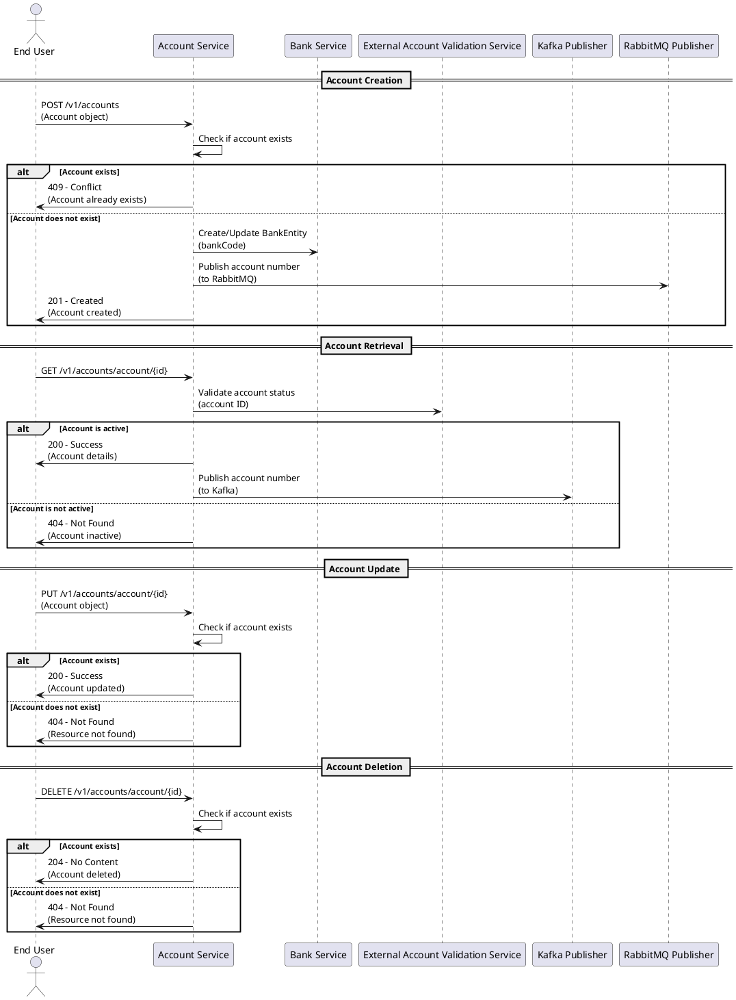

## Business Logic

### 1. Service Summary

The service is designed to manage account-related functionalities, providing a RESTful API for creating, retrieving, updating, and deleting account information. It integrates with various data storage solutions, including a relational database for account data and a non-relational database for bank-related information. The service utilizes a messaging system for asynchronous communication and validation of account status through external services. It also incorporates exception handling for common error scenarios, ensuring robust interactions with clients.

### 2. Component Overview Table

| **Base Path**         | **Source Repository**                    | **Description**                                                                                  |
|-----------------------|------------------------------------------|--------------------------------------------------------------------------------------------------|
| /v1/accounts          | [GitHub Repo Link](#)                   | API for managing account information, including operations for account retrieval, creation, update, and deletion. |

### 3. Overall API Specification

| **Endpoint**          | **Method** | **Description**                                                | **Request Body**           | **Response**                                      | **Authentication** |
|-----------------------|------------|---------------------------------------------------------------|-----------------------------|---------------------------------------------------|--------------------|
| /v1/accounts          | GET        | Retrieve all accounts                                         | None                        | 200 OK: List of accounts                           | No                 |
| /v1/accounts          | POST       | Create a new account                                         | Account object              | 201 Created: Created account                      | No                 |
| /v1/accounts/{id}     | GET        | Retrieve account by ID                                       | None                        | 200 OK: Account details<br>404 Not Found: Account not found | No                 |
| /v1/accounts/{id}     | PUT        | Update an existing account                                    | Account object              | 200 OK: Updated account details<br>404 Not Found: Account not found | No                 |
| /v1/accounts/{id}     | DELETE     | Delete an account by ID                                      | None                        | 204 No Content: Account deleted<br>404 Not Found: Account not found | No                 |

### 4. Detailed Breakdown of Endpoints

#### Endpoint: `/v1/accounts`
- **Method**: GET
- **Description**: Retrieve all accounts.
- **Request Body**: None
- **Response**: 
  - 200 OK: Returns a list of account objects.
  
#### Endpoint: `/v1/accounts`
- **Method**: POST
- **Description**: Create a new account.
- **Request Body**: Account object containing account details.
- **Response**: 
  - 201 Created: Returns the created account object.

#### Endpoint: `/v1/accounts/{id}`
- **Method**: GET
- **Description**: Retrieve an account by its ID.
- **Request Body**: None
- **Response**: 
  - 200 OK: Returns the account object.
  - 404 Not Found: If the account with the specified ID does not exist.

#### Endpoint: `/v1/accounts/{id}`
- **Method**: PUT
- **Description**: Update an existing account by its ID.
- **Request Body**: Account object containing updated account details.
- **Response**: 
  - 200 OK: Returns the updated account object.
  - 404 Not Found: If the account with the specified ID does not exist.

#### Endpoint: `/v1/accounts/{id}`
- **Method**: DELETE
- **Description**: Delete an account by its ID.
- **Request Body**: None
- **Response**: 
  - 204 No Content: If the account was successfully deleted.
  - 404 Not Found: If the account with the specified ID does not exist.

This structured approach provides a clear overview of the service's functionality and API specifications, ensuring easy comprehension for developers and stakeholders involved in the project.

## Plant UML script

Below is a PlantUML sequence diagram script that captures the interactions and process flows based on the provided business logic for the account management system. This script includes all key actors, decision points, and the necessary components involved in the service.



### Explanation of the Diagram:
1. **Actors and Participants**: The diagram includes the `End User`, `Account Service`, `Bank Service`, `External Account Validation Service`, `Kafka Publisher`, and `RabbitMQ Publisher`.
2. **Process Flows**: Each section of the diagram corresponds to a key business process (Account Creation, Retrieval, Update, and Deletion).
3. **Decision Points**: The diagram highlights critical decision points, such as checking if an account exists and validating the account status.
4. **Messages**: Messages are clear and descriptive, indicating the operations being performed and the outcomes.
5. **Endpoints**: Each API endpoint is represented in the interactions, ensuring comprehensive coverage of the service's capabilities.

This PlantUML script can be used to visualize the sequence of interactions in the account management system effectively.

## UML Sequence Diagram


## UML Sequence Diagram Path

account/images/diagram.png

## API Documentation

Here is the detailed API documentation for each endpoint based on the provided business logic.

---

## 1. Retrieve All Accounts

### API Specification
- **Endpoint URL**: `/v1/accounts`
- **HTTP Method**: `GET`
- **Authentication & Authorization Requirements**: No
- **Description of the API Functionality**: Retrieves a list of all accounts managed by the system.

### Request Parameters

| Parameter | Type   | Required | Constraints | Description                     |
|-----------|--------|----------|-------------|---------------------------------|
| None      | N/A    | N/A      | N/A         | No request parameters required. |

### Sample Request
```http
GET /v1/accounts HTTP/1.1
Host: api.example.com
```

### Response Parameters

| Field          | Type       | Description                               |
|----------------|------------|-------------------------------------------|
| accounts       | Array      | List of account objects                   |
| account.id     | String     | Unique identifier for the account         |
| account.name   | String     | Name of the account holder                |
| account.email  | String     | Email address associated with the account  |
| account.accountNumber | String | Unique account number                   |
| account.accountType | String | Type of account (e.g., SAVINGS, CHECKING) |
| account.dob    | Date       | Date of birth of the account holder       |
| account.bankCode | String    | Code of the associated bank               |

### Sample Response
```json
{
  "accounts": [
    {
      "id": "1",
      "name": "John Doe",
      "email": "john.doe@example.com",
      "accountNumber": "123456789",
      "accountType": "SAVINGS",
      "dob": "1980-01-01",
      "bankCode": "XYZ123"
    }
  ]
}
```

### Components Involved
- **Account Service**: Handles the retrieval of accounts.
- **Database**: Stores account information.
- **Kafka**: Publishes messages related to account retrieval.

### Data Mapping

| Source Entity  | Target Entity | Transformation                     |
|----------------|---------------|------------------------------------|
| AccountEntity  | AccountDTO    | Direct mapping of fields           |

### Sample Errors
```json
{
  "error": {
    "code": "500",
    "message": "Internal Server Error"
  }
}
```

### Root Exception Details

| Name               | Description                          | Header/Payload | Type   | Mandatory | Notes                   |
|--------------------|--------------------------------------|----------------|--------|-----------|-------------------------|
| InternalServerError | An unexpected error occurred        | Payload        | String | Yes       | General error response   |

### Error Codes

| HTTP Code | Message                | Description                             |
|-----------|------------------------|-----------------------------------------|
| 500       | Internal Server Error   | An unexpected error occurred.           |

---

## 2. Retrieve Account by ID

### API Specification
- **Endpoint URL**: `/v1/accounts/account`
- **HTTP Method**: `GET`
- **Authentication & Authorization Requirements**: No
- **Description of the API Functionality**: Retrieves details of a specific account identified by its ID.

### Request Parameters

| Parameter | Type   | Required | Constraints | Description                     |
|-----------|--------|----------|-------------|---------------------------------|
| id        | String | Yes      | Must exist  | Unique identifier for the account |

### Sample Request
```http
GET /v1/accounts/account?id=1 HTTP/1.1
Host: api.example.com
```

### Response Parameters

| Field          | Type       | Description                               |
|----------------|------------|-------------------------------------------|
| account        | Object     | Account object details                    |
| account.id     | String     | Unique identifier for the account         |
| account.name   | String     | Name of the account holder                |
| account.email  | String     | Email address associated with the account  |
| account.accountNumber | String | Unique account number                   |
| account.accountType | String | Type of account (e.g., SAVINGS, CHECKING) |
| account.dob    | Date       | Date of birth of the account holder       |
| account.bankCode | String    | Code of the associated bank               |

### Sample Response
```json
{
  "account": {
    "id": "1",
    "name": "John Doe",
    "email": "john.doe@example.com",
    "accountNumber": "123456789",
    "accountType": "SAVINGS",
    "dob": "1980-01-01",
    "bankCode": "XYZ123"
  }
}
```

### Components Involved
- **Account Service**: Handles the retrieval of account details.
- **Database**: Stores account information.
- **External Account Validation Service**: Validates the account status.
- **Kafka**: Publishes messages related to account retrieval.

### Data Mapping

| Source Entity  | Target Entity | Transformation                     |
|----------------|---------------|------------------------------------|
| AccountEntity  | AccountDTO    | Direct mapping of fields           |

### Sample Errors
```json
{
  "error": {
    "code": "404",
    "message": "Account not found"
  }
}
```

### Root Exception Details

| Name               | Description                          | Header/Payload | Type   | Mandatory | Notes                   |
|--------------------|--------------------------------------|----------------|--------|-----------|-------------------------|
| ResourceNotFound    | Account with the specified ID does not exist | Payload        | String | Yes       | Specific error response  |

### Error Codes

| HTTP Code | Message                | Description                             |
|-----------|------------------------|-----------------------------------------|
| 404       | Account not found      | The specified account ID does not exist.|
| 500       | Internal Server Error   | An unexpected error occurred.           |

---

## 3. Create a New Account

### API Specification
- **Endpoint URL**: `/v1/accounts/account`
- **HTTP Method**: `POST`
- **Authentication & Authorization Requirements**: No
- **Description of the API Functionality**: Creates a new account in the system.

### Request Parameters

| Parameter | Type   | Required | Constraints                      | Description                     |
|-----------|--------|----------|----------------------------------|---------------------------------|
| account   | Object | Yes      | Must contain valid fields        | Account object to be created    |

### Sample Request
```http
POST /v1/accounts/account HTTP/1.1
Host: api.example.com
Content-Type: application/json

{
  "name": "John Doe",
  "email": "john.doe@example.com",
  "accountNumber": "123456789",
  "accountType": "SAVINGS",
  "dob": "1980-01-01",
  "bankCode": "XYZ123"
}
```

### Response Parameters

| Field          | Type       | Description                               |
|----------------|------------|-------------------------------------------|
| id             | String     | Unique identifier for the created account |
| accountNumber  | String     | Unique account number                      |

### Sample Response
```json
{
  "id": "1",
  "accountNumber": "123456789"
}
```

### Components Involved
- **Account Service**: Handles account creation.
- **Bank Service**: Manages bank-related data.
- **Database**: Stores account information.
- **RabbitMQ**: Publishes messages related to account creation.

### Data Mapping

| Source Entity  | Target Entity | Transformation                     |
|----------------|---------------|------------------------------------|
| AccountDTO     | AccountEntity | Direct mapping of fields           |

### Sample Errors
```json
{
  "error": {
    "code": "400",
    "message": "Account already exists"
  }
}
```

### Root Exception Details

| Name               | Description                          | Header/Payload | Type   | Mandatory | Notes                   |
|--------------------|--------------------------------------|----------------|--------|-----------|-------------------------|
| BadRequest         | The request body is invalid          | Payload        | String | Yes       | Specific error response  |

### Error Codes

| HTTP Code | Message                | Description                             |
|-----------|------------------------|-----------------------------------------|
| 400       | Account already exists  | An account with the same ID already exists. |
| 500       | Internal Server Error   | An unexpected error occurred.           |

---

## 4. Update an Existing Account

### API Specification
- **Endpoint URL**: `/v1/accounts/account/{id}`
- **HTTP Method**: `PUT`
- **Authentication & Authorization Requirements**: No
- **Description of the API Functionality**: Updates an existing account identified by its ID.

### Request Parameters

| Parameter | Type   | Required | Constraints                      | Description                     |
|-----------|--------|----------|----------------------------------|---------------------------------|
| id        | String | Yes      | Must exist                       | Unique identifier for the account |
| account   | Object | Yes      | Must contain valid fields        | Account object with updated details |

### Sample Request
```http
PUT /v1/accounts/account/1 HTTP/1.1
Host: api.example.com
Content-Type: application/json

{
  "name": "John Smith",
  "email": "john.smith@example.com",
  "accountType": "CHECKING"
}
```

### Response Parameters

| Field          | Type       | Description                               |
|----------------|------------|-------------------------------------------|
| id             | String     | Unique identifier for the updated account  |
| accountNumber  | String     | Unique account number                      |

### Sample Response
```json
{
  "id": "1",
  "accountNumber": "123456789"
}
```

### Components Involved
- **Account Service**: Handles account updates.
- **Database**: Stores updated account information.

### Data Mapping

| Source Entity  | Target Entity | Transformation                     |
|----------------|---------------|------------------------------------|
| AccountDTO     | AccountEntity | Direct mapping of fields           |

### Sample Errors
```json
{
  "error": {
    "code": "404",
    "message": "Account not found"
  }
}
```

### Root Exception Details

| Name               | Description                          | Header/Payload | Type   | Mandatory | Notes                   |
|--------------------|--------------------------------------|----------------|--------|-----------|-------------------------|
| ResourceNotFound    | Account with the specified ID does not exist | Payload        | String | Yes       | Specific error response  |

### Error Codes

| HTTP Code | Message                | Description                             |
|-----------|------------------------|-----------------------------------------|
| 404       | Account not found      | The specified account ID does not exist.|
| 500       | Internal Server Error   | An unexpected error occurred.           |

---

## 5. Delete an Account

### API Specification
- **Endpoint URL**: `/v1/accounts/account/{id}`
- **HTTP Method**: `DELETE`
- **Authentication & Authorization Requirements**: No
- **Description of the API Functionality**: Deletes an existing account identified by its ID.

### Request Parameters

| Parameter | Type   | Required | Constraints                      | Description                     |
|-----------|--------|----------|----------------------------------|---------------------------------|
| id        | String | Yes      | Must exist                       | Unique identifier for the account |

### Sample Request
```http
DELETE /v1/accounts/account/1 HTTP/1.1
Host: api.example.com
```

### Response Parameters

| Field          | Type       | Description                               |
|----------------|------------|-------------------------------------------|
| None           | N/A        | No content in the response                |

### Sample Response
```http
HTTP/1.1 204 No Content
```

### Components Involved
- **Account Service**: Handles account deletion.
- **Database**: Deletes the account information.

### Data Mapping

| Source Entity  | Target Entity | Transformation                     |
|----------------|---------------|------------------------------------|
| AccountEntity  | N/A           | Direct deletion of the entity      |

### Sample Errors
```json
{
  "error": {
    "code": "404",
    "message": "Account not found"
  }
}
```

### Root Exception Details

| Name               | Description                          | Header/Payload | Type   | Mandatory | Notes                   |
|--------------------|--------------------------------------|----------------|--------|-----------|-------------------------|
| ResourceNotFound    | Account with the specified ID does not exist | Payload        | String | Yes       | Specific error response  |

### Error Codes

| HTTP Code | Message                | Description                             |
|-----------|------------------------|-----------------------------------------|
| 404       | Account not found      | The specified account ID does not exist.|
| 500       | Internal Server Error   | An unexpected error occurred.           |

--- 

This structured approach covers each endpoint in detail, ensuring clarity and ease of use for developers and stakeholders interacting with the API.

